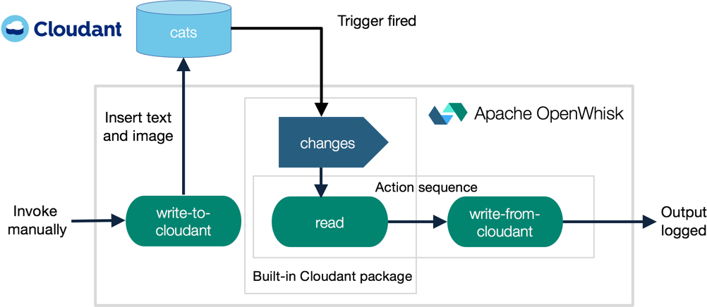

# OpenWhisk 101 - Cloudant Data Processing
This project provides sample code for creating your Cloudant data processing app with Apache OpenWhisk on IBM Bluemix. It should take no more than 10 minutes to get up and running.

This sample assumes you have a basic understanding of the OpenWhisk programming model, which is based on Triggers, Actions, and Rules. If not, you may want to [explore this demo first](https://github.com/IBM/openwhisk-action-trigger-rule).

Serverless platforms like Apache OpenWhisk provide a runtime that scales automatically in response to demand, resulting in a better match between the cost of cloud resources consumed and business value gained.

One of the key use cases for OpenWhisk is to execute logic, on demand, in response to records inserted or updated in a database. Instead of pre-provisioning resources in anticipation of demand, these actions are started and destroyed only as needed in response to demand.

Once you complete this sample application, you can move on to more complex serverless application use cases, such as those named _OpenWhisk 201_ or tagged as [_openwhisk-use-cases_](https://github.com/search?q=topic%3Aopenwhisk-use-cases+org%3AIBM&type=Repositories).

# Overview of Cloudant data processing
The sample demonstrates how to write an action that inserts data in to Cloudant and how to create a second action to respond to that data insertion event.

It also shows how to use built-in actions, such as those provided by the `/whisk.system/cloudant` package along with your custom actions in a _sequence_ to chain units of logic.



# Installation
Setting up this sample involves configuration of OpenWhisk and Cloudant on IBM Bluemix. [If you haven't already signed up for Bluemix and configured OpenWhisk, review those steps first](docs/OPENWHISK.md).

### Provision a Cloudant database
Log into the Bluemix console, provision a Cloudant service instance, and name it `openwhisk-cloudant`. You can reuse an existing instance if you already have one.

Copy `template.local.env` to a new file named `local.env` and update the `CLOUDANT_INSTANCE` value to reflect the name of the Cloudant service instance above.

Then set the `CLOUDANT_USERNAME` and `CLOUDANT_PASSWORD` values based on the service credentials for the service.

Log into the Cloudant web console and create a database, such as `cats`. Set the database name in the `CLOUDANT_DATABASE` variable.

### Bind the Cloudant instance to OpenWhisk
To make Cloudant available to OpenWhisk, we create a "package" along with connection information.

```bash
wsk package bind /whisk.system/cloudant "$CLOUDANT_INSTANCE" \
  --param username "$CLOUDANT_USERNAME" \
  --param password "$CLOUDANT_PASSWORD" \
  --param host "$CLOUDANT_USERNAME.cloudant.com" \
  --param dbname "$CLOUDANT_DATABASE"
```

### Use the `deploy.sh` script to automate the steps above
The commands above exist in a convenience script that reads the environment variables out of `local.env` and injects them where needed.

Change to the root directory, and install the app using `deploy.sh`.

> **Note**: `deploy.sh` will be replaced with the [`wskdeploy`](https://github.com/openwhisk/openwhisk-wskdeploy) tool in the future. `wskdeploy` uses a manifest to create the triggers, actions, and rules that power the sample.

```bash
./deploy.sh --install
```
## Testing
To test, confirm that your Cloudant database is empty. Then invoke the first action manually.

Open one terminal window to poll the logs:
```bash
wsk activation poll
```

And in a second terminal, invoke the action:
```bash
wsk action invoke --blocking --result write-to-cloudant
```

## Troubleshooting
The first place to check for errors is the OpenWhisk activation log. You can view it by tailing the log on the command line with `wsk activation poll` or you can view the [monitoring console on Bluemix](https://console.ng.bluemix.net/openwhisk/dashboard).

## Cleaning up
To remove all the API mappings and delete the actions, you can use `./deploy.sh --uninstall` or perform the deletions manually.

# License
Licensed under the [Apache 2.0 license](LICENSE.txt).
